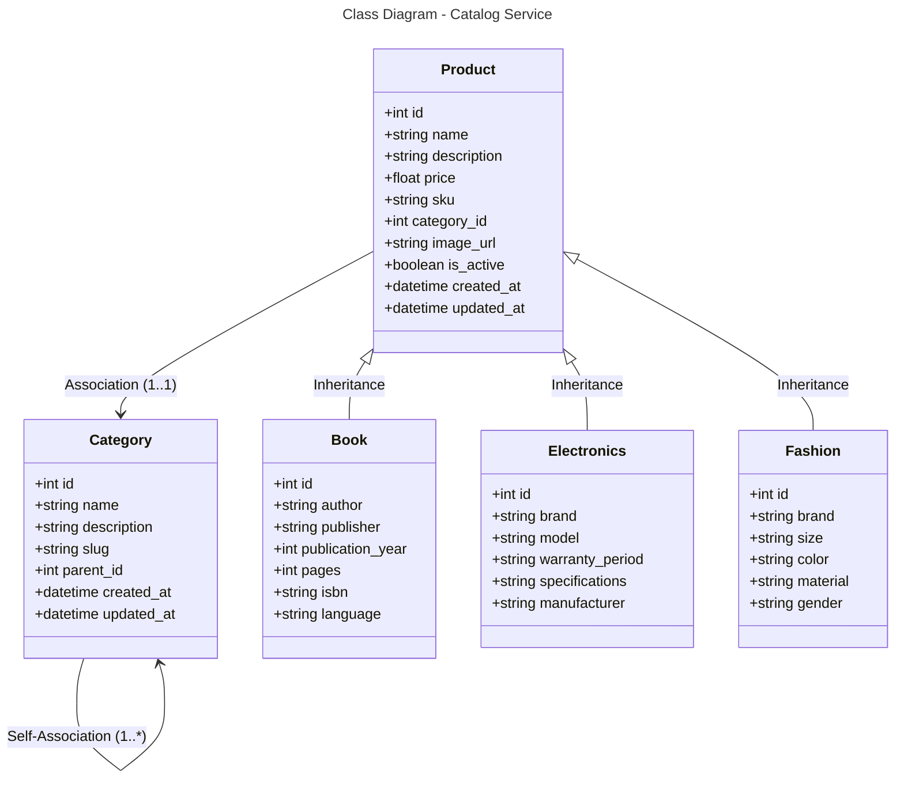
```mermaid
---
title: Class Diagram - Catalog Service
---
classDiagram
    class Category {
        +int id
        +string name
        +string description
        +string slug
        +int parent_id
        +datetime created_at
        +datetime updated_at
    }
    
    class Product {
        +int id
        +string name
        +string description
        +float price
        +string sku
        +int category_id
        +string image_url
        +boolean is_active
        +datetime created_at
        +datetime updated_at
    }
    
    class Book {
        +int id
        +string author
        +string publisher
        +int publication_year
        +int pages
        +string isbn
        +string language
    }
    
    class Electronics {
        +int id
        +string brand
        +string model
        +string warranty_period
        +string specifications
        +string manufacturer
    }
    
    class Fashion {
        +int id
        +string brand
        +string size
        +string color
        +string material
        +string gender
    }
    
    Product <|-- Book : Inheritance
    Product <|-- Electronics : Inheritance
    Product <|-- Fashion : Inheritance
    Product --> Category : Association (1..1)
    Category --> Category : Self-Association (1..*)
```

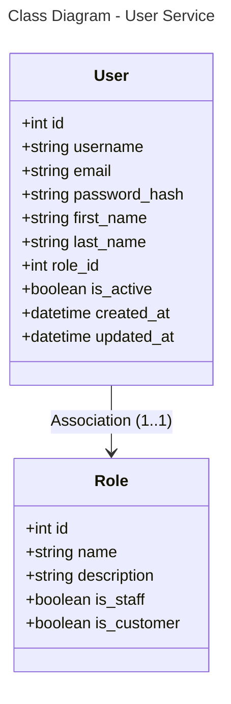
```mermaid
---
title: Class Diagram - User Service
---
classDiagram
    class User {
        +int id
        +string username
        +string email
        +string password_hash
        +string first_name
        +string last_name
        +int role_id
        +boolean is_active
        +datetime created_at
        +datetime updated_at
    }
    
    class Role {
        +int id
        +string name
        +string description
        +boolean is_staff
        +boolean is_customer
    }
    
    User --> Role : Association (1..1)
```

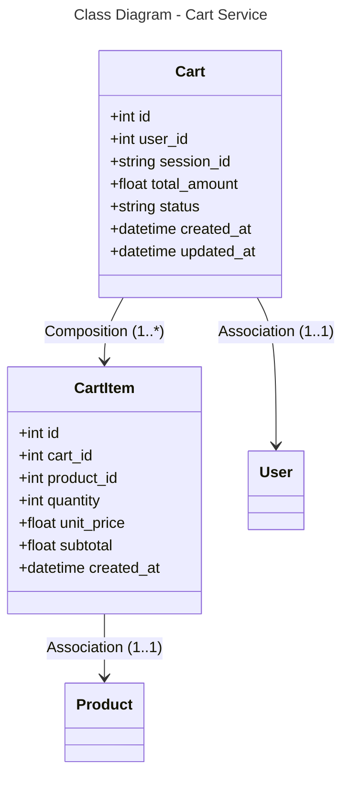
```mermaid
---
title: Class Diagram - Cart Service
---
classDiagram
    class Cart {
        +int id
        +int user_id
        +string session_id
        +float total_amount
        +string status
        +datetime created_at
        +datetime updated_at
    }
    
    class CartItem {
        +int id
        +int cart_id
        +int product_id
        +int quantity
        +float unit_price
        +float subtotal
        +datetime created_at
    }
    
    Cart --> CartItem : Composition (1..*)
    Cart --> User : Association (1..1)
    CartItem --> Product : Association (1..1)
```

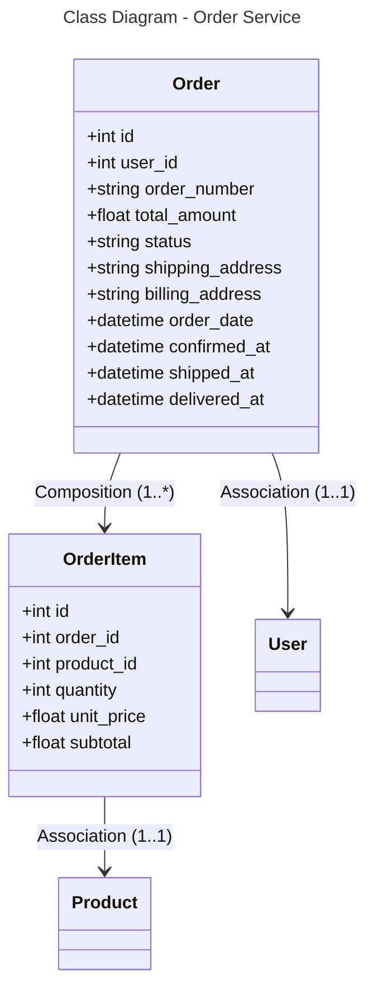
```mermaid
---
title: Class Diagram - Order Service
---
classDiagram
    class Order {
        +int id
        +int user_id
        +string order_number
        +float total_amount
        +string status
        +string shipping_address
        +string billing_address
        +datetime order_date
        +datetime confirmed_at
        +datetime shipped_at
        +datetime delivered_at
    }
    
    class OrderItem {
        +int id
        +int order_id
        +int product_id
        +int quantity
        +float unit_price
        +float subtotal
    }
    
    Order --> OrderItem : Composition (1..*)
    Order --> User : Association (1..1)
    OrderItem --> Product : Association (1..1)
```

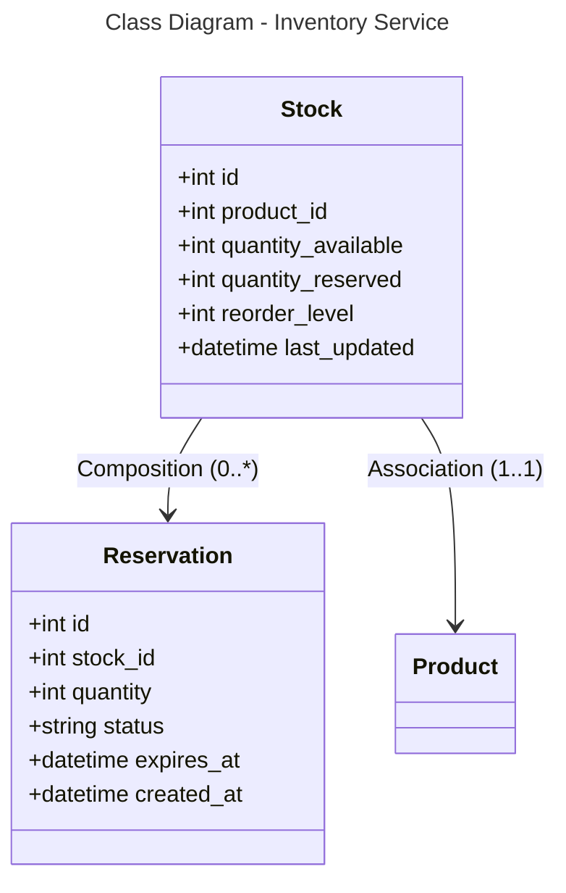
```mermaid
---
title: Class Diagram - Inventory Service
---
classDiagram
    class Stock {
        +int id
        +int product_id
        +int quantity_available
        +int quantity_reserved
        +int reorder_level
        +datetime last_updated
    }
    
    class Reservation {
        +int id
        +int stock_id
        +int quantity
        +string status
        +datetime expires_at
        +datetime created_at
    }
    
    Stock --> Reservation : Composition (0..*)
    Stock --> Product : Association (1..1)
```

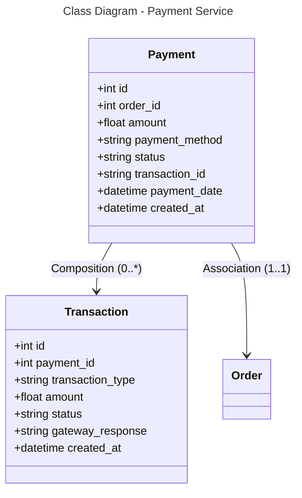
```mermaid
---
title: Class Diagram - Payment Service
---
classDiagram
    class Payment {
        +int id
        +int order_id
        +float amount
        +string payment_method
        +string status
        +string transaction_id
        +datetime payment_date
        +datetime created_at
    }
    
    class Transaction {
        +int id
        +int payment_id
        +string transaction_type
        +float amount
        +string status
        +string gateway_response
        +datetime created_at
    }
    
    Payment --> Transaction : Composition (0..*)
    Payment --> Order : Association (1..1)
```

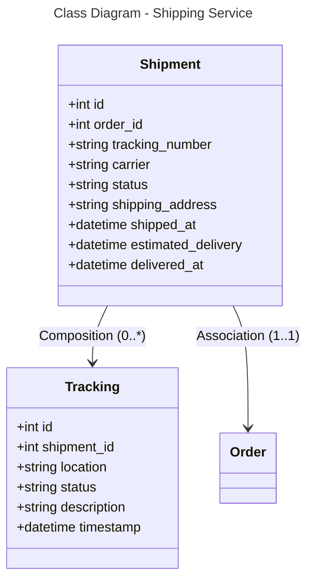
```mermaid
---
title: Class Diagram - Shipping Service
---
classDiagram
    class Shipment {
        +int id
        +int order_id
        +string tracking_number
        +string carrier
        +string status
        +string shipping_address
        +datetime shipped_at
        +datetime estimated_delivery
        +datetime delivered_at
    }
    
    class Tracking {
        +int id
        +int shipment_id
        +string location
        +string status
        +string description
        +datetime timestamp
    }
    
    Shipment --> Tracking : Composition (0..*)
    Shipment --> Order : Association (1..1)
```

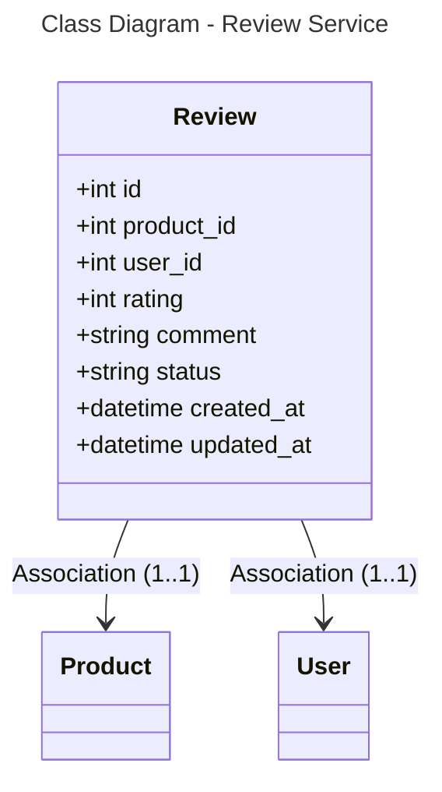
```mermaid
---
title: Class Diagram - Review Service
---
classDiagram
    class Review {
        +int id
        +int product_id
        +int user_id
        +int rating
        +string comment
        +string status
        +datetime created_at
        +datetime updated_at
    }
    
    Review --> Product : Association (1..1)
    Review --> User : Association (1..1)
```

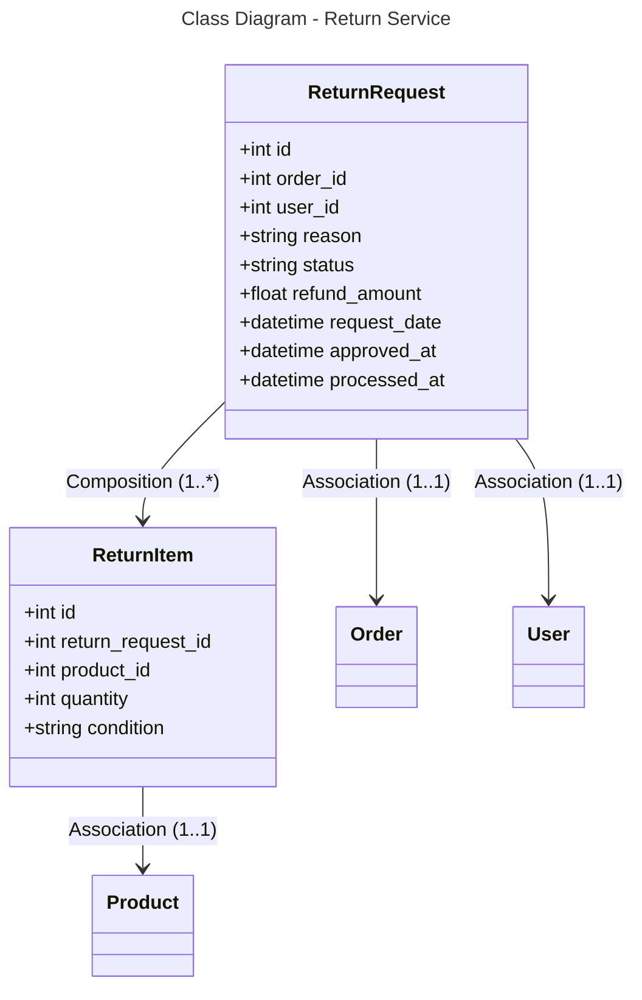
```mermaid
---
title: Class Diagram - Return Service
---
classDiagram
    class ReturnRequest {
        +int id
        +int order_id
        +int user_id
        +string reason
        +string status
        +float refund_amount
        +datetime request_date
        +datetime approved_at
        +datetime processed_at
    }
    
    class ReturnItem {
        +int id
        +int return_request_id
        +int product_id
        +int quantity
        +string condition
    }
    
    ReturnRequest --> ReturnItem : Composition (1..*)
    ReturnRequest --> Order : Association (1..1)
    ReturnRequest --> User : Association (1..1)
    ReturnItem --> Product : Association (1..1)
```

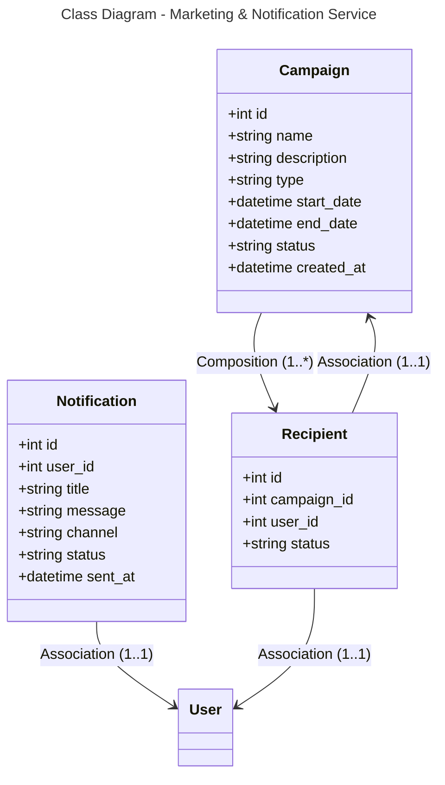
```mermaid
---
title: Class Diagram - Marketing & Notification Service
---
classDiagram
    class Campaign {
        +int id
        +string name
        +string description
        +string type
        +datetime start_date
        +datetime end_date
        +string status
        +datetime created_at
    }
    
    class Notification {
        +int id
        +int user_id
        +string title
        +string message
        +string channel
        +string status
        +datetime sent_at
    }
    
    class Recipient {
        +int id
        +int campaign_id
        +int user_id
        +string status
    }
    
    Campaign --> Recipient : Composition (1..*)
    Notification --> User : Association (1..1)
    Recipient --> User : Association (1..1)
    Recipient --> Campaign : Association (1..1)
```

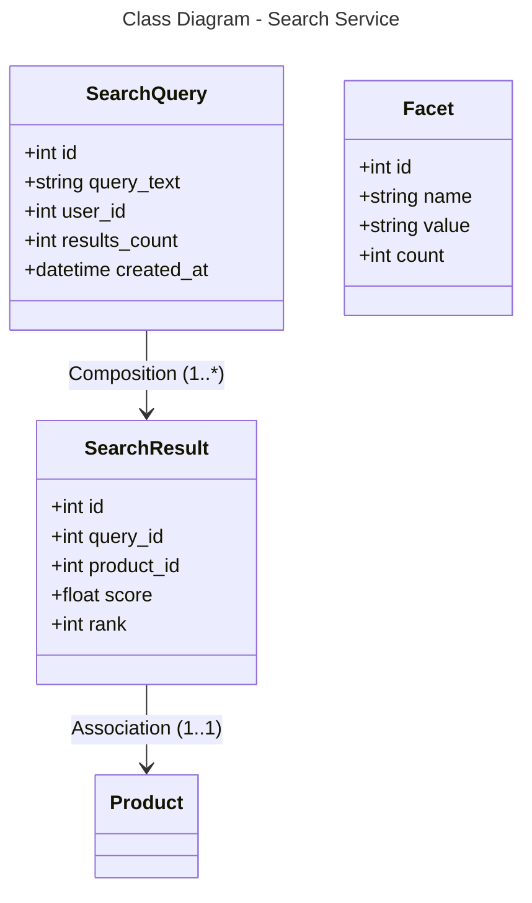
```mermaid
---
title: Class Diagram - Search Service
---
classDiagram
    class SearchQuery {
        +int id
        +string query_text
        +int user_id
        +int results_count
        +datetime created_at
    }
    
    class SearchResult {
        +int id
        +int query_id
        +int product_id
        +float score
        +int rank
    }
    
    class Facet {
        +int id
        +string name
        +string value
        +int count
    }
    
    SearchQuery --> SearchResult : Composition (1..*)
    SearchResult --> Product : Association (1..1)
```