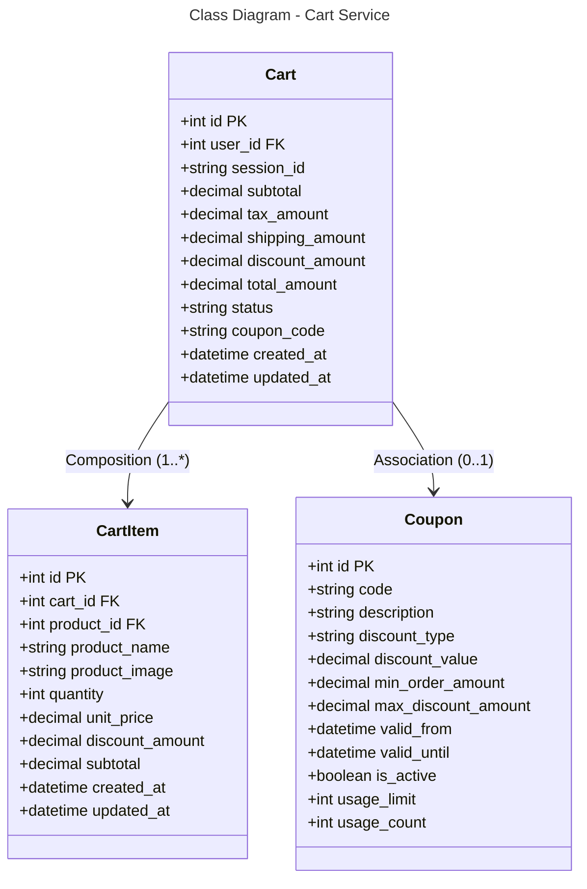

### Database Mapping (PostgreSQL)

**Table: carts**
- `id` (PK), `user_id` (FK), `session_id` - Cart identification
- `subtotal`, `tax_amount`, `shipping_amount`, `discount_amount`, `total_amount` - Money fields
- `status` - active, checked_out, expired
- `coupon_code` - Applied coupon
- Timestamps

**Table: cart_items**
- `id` (PK), `cart_id` (FK), `product_id` (FK) - References
- `product_name`, `product_image` - Denormalized product info
- `quantity`, `unit_price`, `discount_amount`, `subtotal` - Item details
- Timestamps

**Table: coupons**
- `id` (PK), `code` - Unique coupon code
- `description`, `discount_type` - percentage/fixed
- `discount_value` - Discount amount or percentage
- `min_order_amount`, `max_discount_amount` - Conditions
- `valid_from`, `valid_until` - Validity period
- `is_active`, `usage_limit`, `usage_count` - Usage tracking

**Relationships:**
- Cart → CartItem: One-to-Many (1:*)
- Cart → Coupon: Optional One-to-One (0:1)