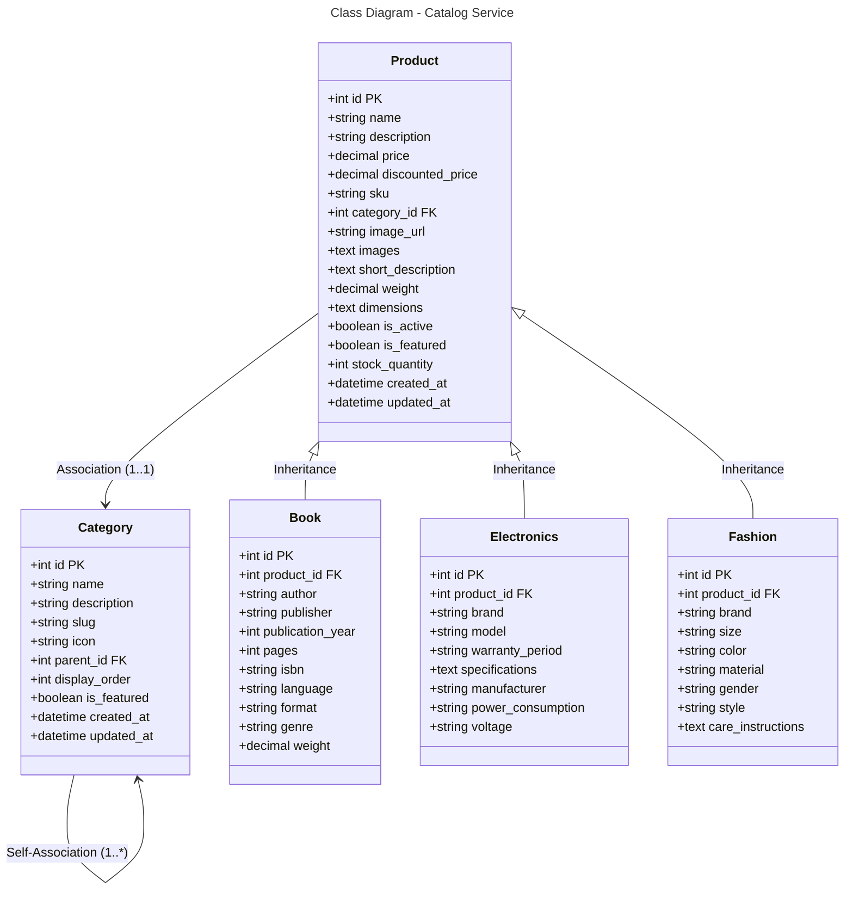

### Database Mapping (MySQL)

**Table: categories**
- `id` (PK) - Auto increment
- `name` - Category name
- `description` - Category description
- `slug` - URL-friendly slug
- `icon` - Category icon
- `parent_id` (FK) - Self-reference to parent category
- `display_order` - Sort order
- `is_featured` - Featured flag
- `created_at`, `updated_at` - Timestamps

**Table: products**
- `id` (PK) - Auto increment
- `name`, `description` - Product info
- `price`, `discounted_price` - Pricing
- `sku` - Stock keeping unit
- `category_id` (FK) - Reference to categories
- `image_url`, `images` - Images (JSON array)
- `short_description`, `weight`, `dimensions` - Product details
- `is_active`, `is_featured` - Status flags
- `stock_quantity` - Initial stock
- Timestamps

**Table: books** (1:1 with products)
- `id` (PK), `product_id` (FK)
- Author, publisher, publication_year, pages, isbn, language, format, genre, weight

**Table: electronics** (1:1 with products)
- `id` (PK), `product_id` (FK)
- Brand, model, warranty_period, specifications, manufacturer, power_consumption, voltage

**Table: fashion** (1:1 with products)
- `id` (PK), `product_id` (FK)
- Brand, size, color, material, gender, style, care_instructions

**Relationships:**
- Product → Category: Many-to-One (*:1)
- Category → Category: Self-association (*:1)
- Product → Book/Electronics/Fashion: One-to-One (1:1)