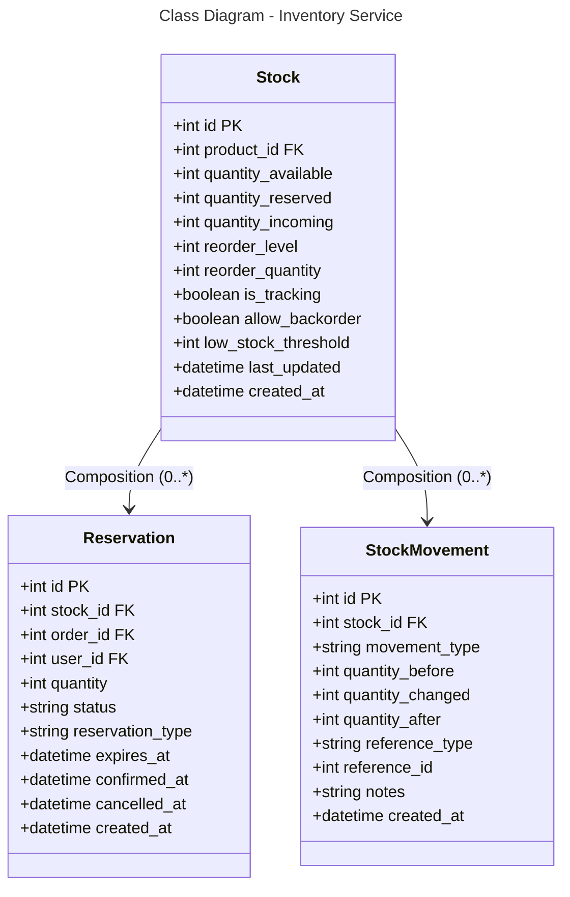

### Database Mapping (PostgreSQL)

**Table: stocks**
- `id` (PK), `product_id` (FK) - Product reference
- `quantity_available` - Current available stock
- `quantity_reserved` - Reserved (pending orders)
- `quantity_incoming` - Incoming stock (on the way)
- `reorder_level` - When to reorder (threshold)
- `reorder_quantity` - How much to reorder
- `is_tracking` - Enable stock tracking
- `allow_backorder` - Allow backorder when out of stock
- `low_stock_threshold` - Low stock warning level
- `last_updated`, `created_at` - Timestamps

**Table: reservations**
- `id` (PK), `stock_id` (FK), `order_id` (FK), `user_id` (FK)
- `quantity` - Reserved quantity
- `status` - pending, confirmed, expired, cancelled
- `reservation_type` - checkout, hold
- `expires_at` - Expiration time
- `confirmed_at`, `cancelled_at` - Status timestamps
- `created_at`

**Table: stock_movements**
- `id` (PK), `stock_id` (FK)
- `movement_type` - stock_in, stock_out, adjustment
- `quantity_before`, `quantity_changed`, `quantity_after`
- `reference_type`, `reference_id` - Reference to order/cart
- `notes`, `created_at`

**Relationships:**
- Stock → Reservation: One-to-Many (0:*)
- Stock → StockMovement: One-to-Many (0:*)
- Stock ↔ Product: Many-to-One