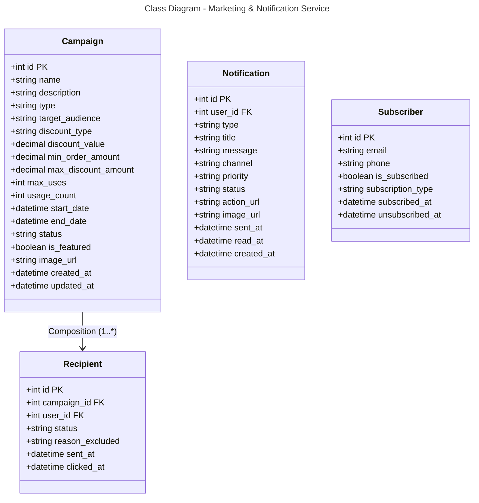

### Database Mapping (PostgreSQL)

**Table: campaigns**
- `id` (PK)
- `name`, `description`, `type` - Campaign info (promotion, flash_sale, newsletter)
- `target_audience` - all, new_customer, vip, etc.
- `discount_type` - percentage, fixed
- `discount_value` - Discount amount/percentage
- `min_order_amount`, `max_discount_amount` - Conditions
- `max_uses`, `usage_count` - Usage tracking
- `start_date`, `end_date` - Campaign period
- `status` - draft, active, paused, ended
- `is_featured`, `image_url`
- Timestamps

**Table: notifications**
- `id` (PK), `user_id` (FK)
- `type` - order, payment, system, promotion
- `title`, `message` - Content
- `channel` - email, sms, push, in_app
- `priority` - low, normal, high
- `status` - pending, sent, read
- `action_url` - Click action URL
- `image_url`
- `sent_at`, `read_at`, `created_at`

**Table: recipients**
- `id` (PK), `campaign_id` (FK), `user_id` (FK)
- `status` - pending, sent, clicked, failed
- `reason_excluded` - Exclusion reason
- `sent_at`, `clicked_at`

**Table: subscribers**
- `id` (PK)
- `email`, `phone` - Contact info
- `is_subscribed` - Subscription status
- `subscription_type` - newsletter, sms, all
- `subscribed_at`, `unsubscribed_at`

**Relationships:**
- Campaign → Recipient: One-to-Many (1:*)