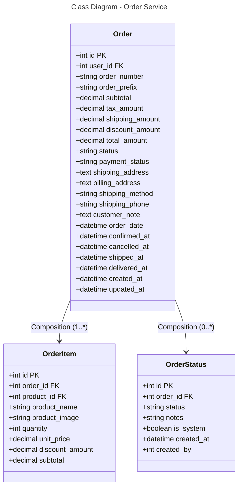

### Database Mapping (PostgreSQL)

**Table: orders**
- `id` (PK), `user_id` (FK) - Order identification
- `order_number`, `order_prefix` - Unique order number (e.g., ORD-2024-001)
- `subtotal`, `tax_amount`, `shipping_amount`, `discount_amount`, `total_amount` - Money
- `status` - pending, confirmed, shipped, delivered, cancelled
- `payment_status` - pending, paid, failed, refunded
- `shipping_address`, `billing_address` - Full address (JSON/text)
- `shipping_method`, `shipping_phone` - Shipping details
- `customer_note` - Customer notes
- `order_date`, `confirmed_at`, `cancelled_at`, `shipped_at`, `delivered_at` - Status timestamps
- Timestamps

**Table: order_items**
- `id` (PK), `order_id` (FK), `product_id` (FK)
- `product_name`, `product_image` - Denormalized product info
- `quantity`, `unit_price`, `discount_amount`, `subtotal`

**Table: order_statuses**
- `id` (PK), `order_id` (FK)
- `status`, `notes` - Status history
- `is_system` - System update flag
- `created_at`, `created_by` - Who created the status

**Relationships:**
- Order → OrderItem: One-to-Many (1:*)
- Order → OrderStatus: One-to-Many (0:*)
- Order ↔ User: Many-to-One