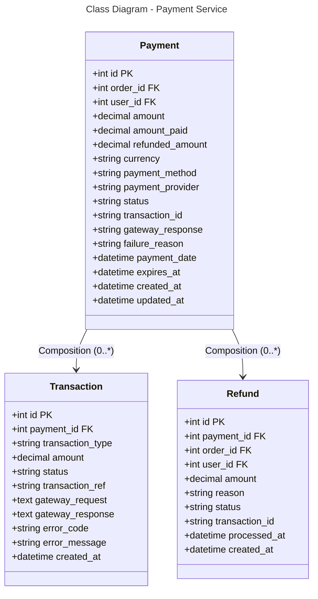

### Database Mapping (PostgreSQL)

**Table: payments**
- `id` (PK), `order_id` (FK), `user_id` (FK) - References
- `amount` - Total payment amount
- `amount_paid` - Actually paid amount
- `refunded_amount` - Refunded amount
- `currency` - Currency code (VND, USD)
- `payment_method` - cod, credit_card, bank_transfer, momo
- `payment_provider` - vnpay, stripe, paypal
- `status` - pending, completed, failed, refunded, expired
- `transaction_id` - Provider transaction ID
- `gateway_response` - Provider response (JSON/text)
- `failure_reason` - Failure message
- `payment_date`, `expires_at` - Payment timing
- Timestamps

**Table: transactions**
- `id` (PK), `payment_id` (FK)
- `transaction_type` - authorization, capture, refund
- `amount`, `status`
- `transaction_ref` - Reference from provider
- `gateway_request`, `gateway_response`
- `error_code`, `error_message`

**Table: refunds**
- `id` (PK), `payment_id` (FK), `order_id` (FK), `user_id` (FK)
- `amount`, `reason`, `status`
- `transaction_id`, `processed_at`

**Relationships:**
- Payment → Transaction: One-to-Many (0:*)
- Payment → Refund: One-to-Many (0:*)