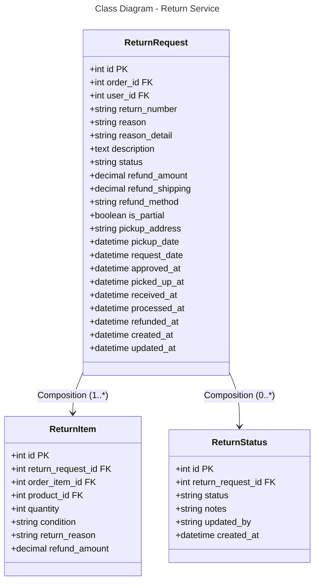

### Database Mapping (PostgreSQL)

**Table: return_requests**
- `id` (PK), `order_id` (FK), `user_id` (FK)
- `return_number` - Unique return number (e.g., RTN-2024-001)
- `reason` - Main reason (defective, wrong_item, not_as_described)
- `reason_detail` - Detailed reason
- `description` - Additional description
- `status` - pending, approved, picked_up, received, processing, refunded, rejected
- `refund_amount`, `refund_shipping` - Refund amounts
- `refund_method` - original_payment, bank_transfer
- `is_partial` - Partial return flag
- `pickup_address`, `pickup_date` - Pickup scheduling
- Status timestamps: request_date, approved_at, picked_up_at, received_at, processed_at, refunded_at
- Timestamps

**Table: return_items**
- `id` (PK), `return_request_id` (FK), `order_item_id` (FK), `product_id` (FK)
- `quantity`, `condition` - Item condition at return
- `return_reason`, `refund_amount`

**Table: return_statuses**
- `id` (PK), `return_request_id` (FK)
- `status`, `notes` - Status history
- `updated_by`, `created_at`

**Relationships:**
- ReturnRequest → ReturnItem: One-to-Many (1:*)
- ReturnRequest → ReturnStatus: One-to-Many (0:*)