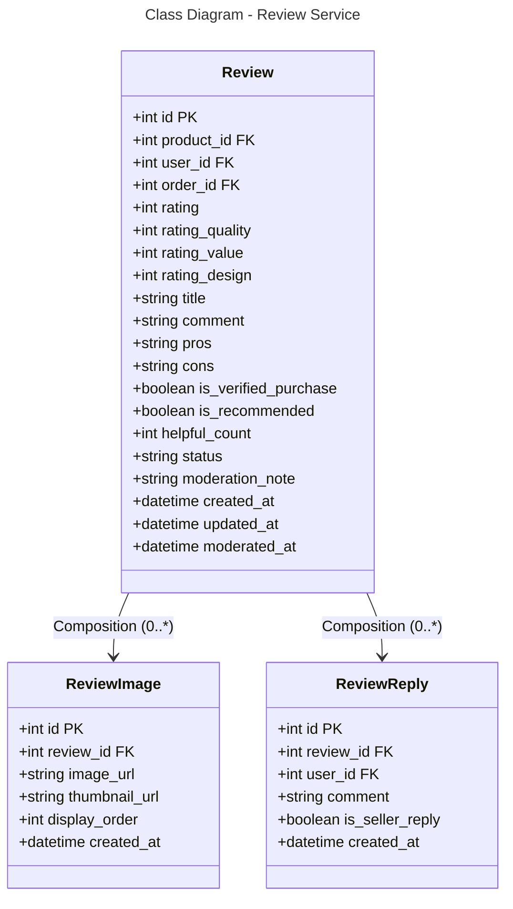

### Database Mapping (PostgreSQL)

**Table: reviews**
- `id` (PK), `product_id` (FK), `user_id` (FK), `order_id` (FK)
- `rating` - Overall rating (1-5 stars)
- `rating_quality`, `rating_value`, `rating_design` - Detailed ratings
- `title`, `comment` - Review content
- `pros`, `cons` - Pros and cons
- `is_verified_purchase` - Verified buyer flag
- `is_recommended` - Recommended flag
- `helpful_count` - Helpful votes
- `status` - pending, approved, rejected
- `moderation_note` - Moderation reason
- `created_at`, `updated_at`, `moderated_at` - Timestamps

**Table: review_images**
- `id` (PK), `review_id` (FK)
- `image_url`, `thumbnail_url`
- `display_order`, `created_at`

**Table: review_replies**
- `id` (PK), `review_id` (FK), `user_id` (FK)
- `comment`, `is_seller_reply`
- `created_at`

**Relationships:**
- Review → ReviewImage: One-to-Many (0:*)
- Review → ReviewReply: One-to-Many (0:*)