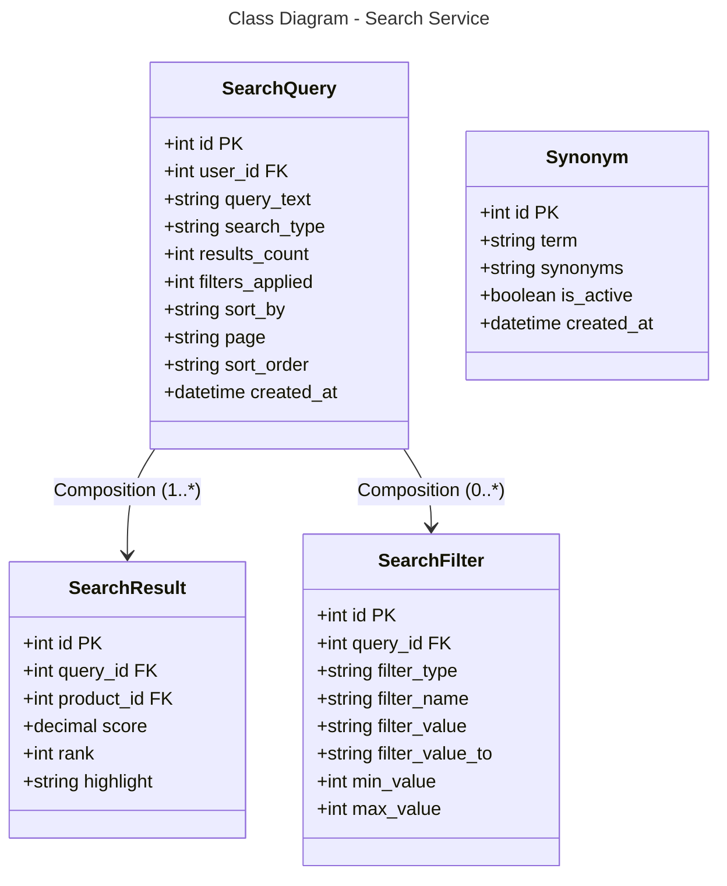

### Database Mapping (PostgreSQL + Elasticsearch)

**Table: search_queries**
- `id` (PK), `user_id` (FK) - Query identification
- `query_text` - Search text
- `search_type` - product, category, all
- `results_count` - Number of results
- `filters_applied` - Number of filters
- `sort_by` - relevance, price, new
- `page`, `sort_order` - Pagination
- `created_at`

**Table: search_results**
- `id` (PK), `query_id` (FK), `product_id` (FK)
- `score` - Elasticsearch score
- `rank` - Display rank
- `highlight` - Highlighted text

**Table: search_filters**
- `id` (PK), `query_id` (FK)
- `filter_type` - price, category, brand
- `filter_name`, `filter_value`, `filter_value_to`
- `min_value`, `max_value` - Range filters

**Table: synonyms**
- `id` (PK)
- `term` - Original term
- `synonyms` - Comma-separated synonyms
- `is_active`, `created_at`

**Note:** Facet data is stored in Elasticsearch, not PostgreSQL.

**Relationships:**
- SearchQuery → SearchResult: One-to-Many (1:*)
- SearchQuery → SearchFilter: One-to-Many (0:*)