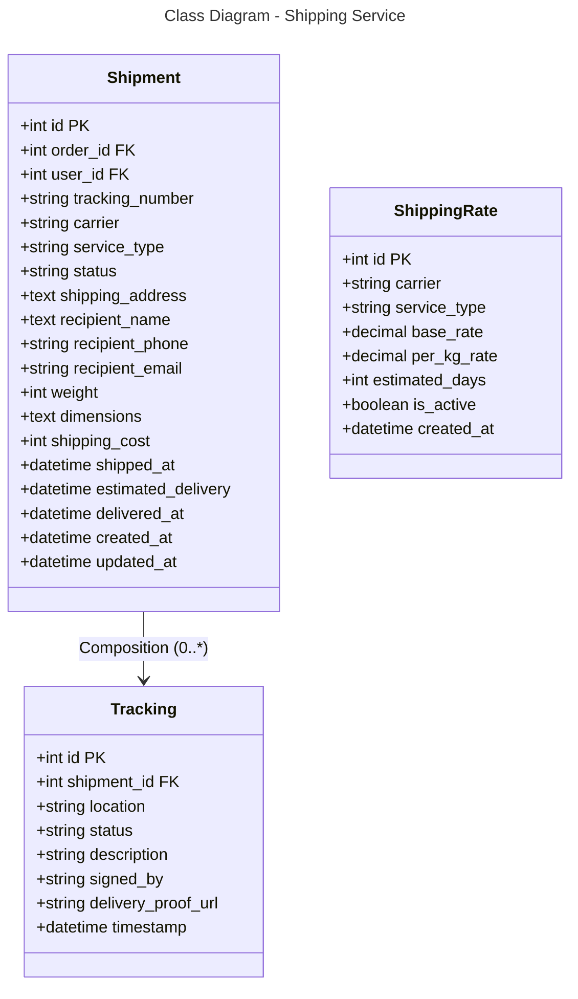

### Database Mapping (PostgreSQL)

**Table: shipments**
- `id` (PK), `order_id` (FK), `user_id` (FK)
- `tracking_number` - Tracking number (e.g., VNPOST123456)
- `carrier` - ghn, ghtk, viettel, jntf
- `service_type` - express, standard, economy
- `status` - pending, shipped, in_transit, delivered, failed
- `shipping_address` - Full shipping address
- `recipient_name`, `recipient_phone`, `recipient_email`
- `weight` (grams), `dimensions` (JSON)
- `shipping_cost` - Shipping fee
- `shipped_at`, `estimated_delivery`, `delivered_at` - Timing
- Timestamps

**Table: trackings**
- `id` (PK), `shipment_id` (FK)
- `location` - Current location
- `status`, `description`
- `signed_by` - Who signed for delivery
- `delivery_proof_url` - Proof image URL
- `timestamp`

**Table: shipping_rates**
- `id` (PK)
- `carrier`, `service_type` - Rate identification
- `base_rate`, `per_kg_rate` - Rate calculation
- `estimated_days` - Delivery days
- `is_active`, `created_at`

**Relationships:**
- Shipment → Tracking: One-to-Many (0:*)
- Shipment ↔ Order: Many-to-One
- Shipment → ShippingRate: Optional One-to-One