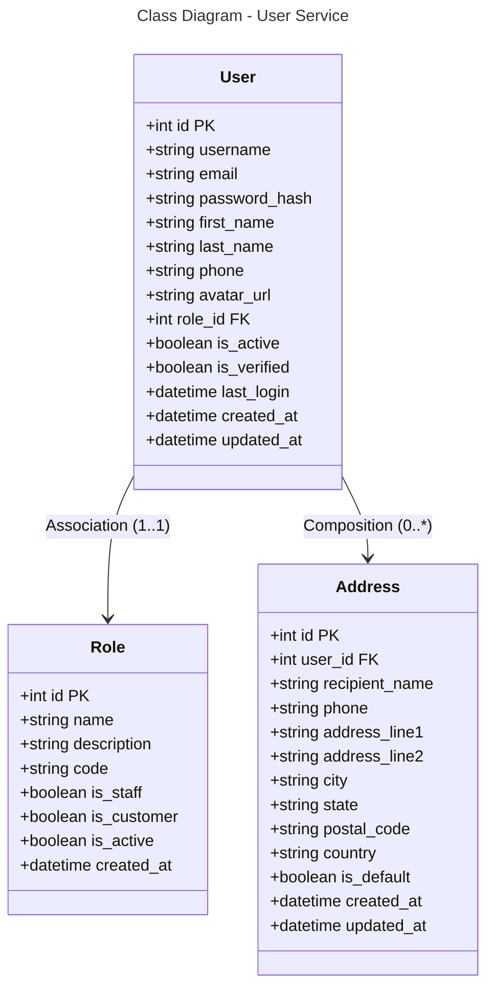

### Database Mapping (PostgreSQL)

**Table: users**
- `id` (PK) - Auto increment
- `username`, `email`, `password_hash` - Credentials
- `first_name`, `last_name`, `phone` - Personal info
- `avatar_url` - Profile image URL
- `role_id` (FK) - Reference to roles
- `is_active`, `is_verified` - Status flags
- `last_login` - Last login timestamp
- `created_at`, `updated_at` - Timestamps

**Table: roles**
- `id` (PK), `name`, `description`, `code` - Role info
- `is_staff`, `is_customer`, `is_active` - Role flags
- `created_at`

**Table: addresses**
- `id` (PK), `user_id` (FK)
- `recipient_name`, `phone`, `address_line1`, `address_line2`
- `city`, `state`, `postal_code`, `country`
- `is_default` - Default shipping address
- Timestamps

**Relationships:**
- User → Role: Many-to-One (*:1)
- User → Address: One-to-Many (1:*)