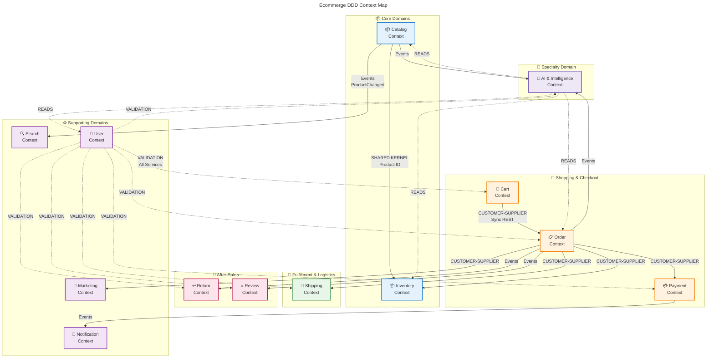
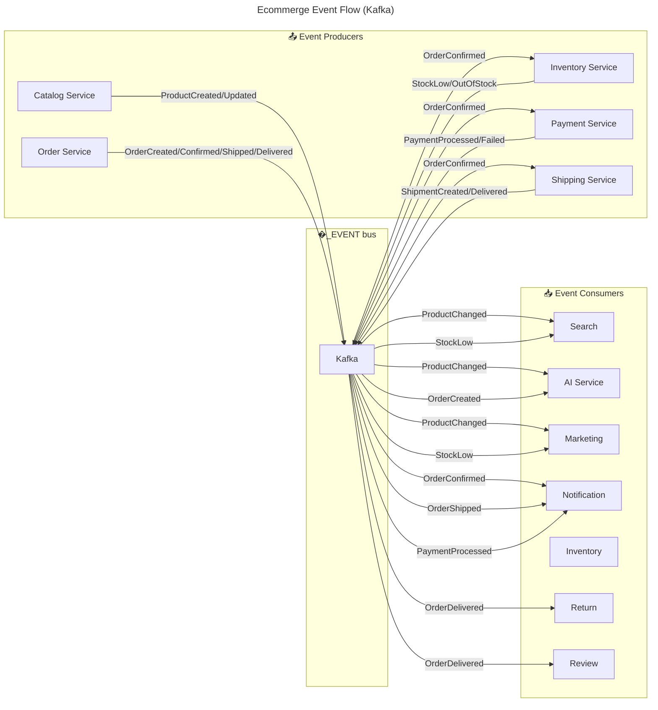
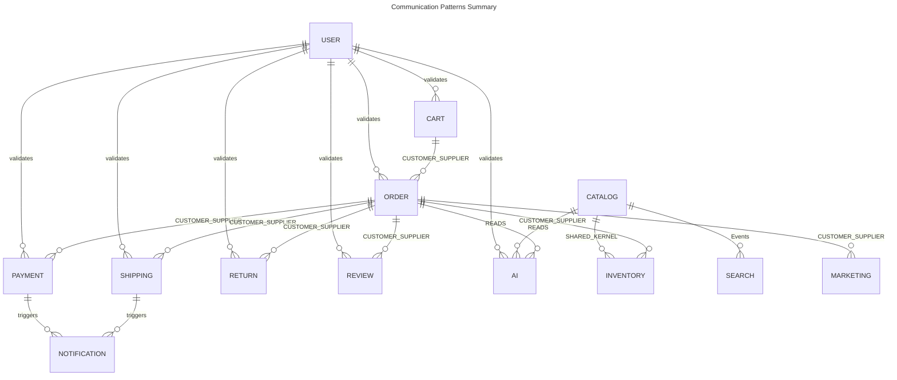

```mermaid
---
title: Ecommerge DDD Context Map
---
flowchart TB
    subgraph Core["📦 Core Domains"]
        direction LR
        Catalog["📦 Catalog<br/>Context"]
        Inventory["📦 Inventory<br/>Context"]
    end
    
    subgraph Shopping["🛒 Shopping & Checkout"]
        direction LR
        Cart["🛒 Cart<br/>Context"]
        Order["📋 Order<br/>Context"]
        Payment["💳 Payment<br/>Context"]
    end
    
    subgraph Fulfillment["🚚 Fulfillment & Logistics"]
        Shipping["🚚 Shipping<br/>Context"]
    end
    
    subgraph AfterSales["🔄 After-Sales"]
        direction LR
        Return["↩️ Return<br/>Context"]
        Review["⭐ Review<br/>Context"]
    end
    
    subgraph Supporting["⚙️ Supporting Domains"]
        direction LR
        Search["🔍 Search<br/>Context"]
        User["👤 User<br/>Context"]
        Marketing["📢 Marketing<br/>Context"]
        Notification["🔔 Notification<br/>Context"]
    end
    
    subgraph Specialty["🤖 Specialty Domain"]
        AI["🤖 AI & Intelligence<br/>Context"]
    end
    
    %% Relationships
    Catalog -->|SHARED KERNEL<br/>Product ID| Inventory
    Catalog -->|Events<br/>ProductChanged| Search
    Catalog -->|Events| AI
    
    Cart -->|CUSTOMER-SUPPLIER<br/>Sync REST| Order
    Order -->|CUSTOMER-SUPPLIER| Payment
    Order -->|CUSTOMER-SUPPLIER| Inventory
    Order -->|CUSTOMER-SUPPLIER| Shipping
    Order -->|CUSTOMER-SUPPLIER| Marketing
    Order -->|Events| AI
    
    User -.->|VALIDATION<br/>All Services| Cart
    User -.->|VALIDATION| Order
    User -.->|VALIDATION| Payment
    User -.->|VALIDATION| Shipping
    User -.->|VALIDATION| Return
    User -.->|VALIDATION| Review
    User -.->|VALIDATION| AI
    
    Payment -->|Events| Notification
    
    Order -->|Events| Return
    Order -->|Events| Review
    
    AI -.->|READS| Catalog
    AI -.->|READS| Inventory
    AI -.->|READS| Order
    AI -.->|READS| User
    
    classDef core fill:#e3f2fd,stroke:#1976d2,stroke-width:2px
    classDef shopping fill:#fff3e0,stroke:#f57c00,stroke-width:2px
    classDef fulfillment fill:#e8f5e9,stroke:#388e3c,stroke-width:2px
    classDef aftersales fill:#fce4ec,stroke:#c2185b,stroke-width:2px
    classDef supporting fill:#f3e5f5,stroke:#7b1fa2,stroke-width:2px
    classDef specialty fill:#ede7f6,stroke:#512da8,stroke-width:2px
    
    class Catalog,Inventory core
    class Cart,Order,Payment shopping
    class Shipping fulfillment
    class Return,Review aftersales
    class Search,User,Marketing,Notification supporting
    class AI specialty
```

```mermaid
---
title: Ecommerge Event Flow (Kafka)
---
flowchart LR
    subgraph Producers["📤 Event Producers"]
        CAT[Catalog Service]
        INV[Inventory Service]
        ORD[Order Service]
        PAY[Payment Service]
        SHIP[Shipping Service]
    end
    
    subgraph Kafka["�_EVENT bus"]
        K[Kafka]
    end
    
    subgraph Consumers["📥 Event Consumers"]
        SEARCH[Search]
        AI[AI Service]
        MKT[Marketing]
        NOTIF[Notification]
        INV2[Inventory]
        RET[Return]
        REV[Review]
    end
    
    CAT -->|ProductCreated/Updated| K
    INV -->|StockLow/OutOfStock| K
    ORD -->|OrderCreated/Confirmed/Shipped/Delivered| K
    PAY -->|PaymentProcessed/Failed| K
    SHIP -->|ShipmentCreated/Delivered| K
    
    K -->|ProductChanged| SEARCH
    K -->|ProductChanged| AI
    K -->|ProductChanged| MKT
    K -->|StockLow| MKT
    K -->|StockLow| SEARCH
    K -->|OrderConfirmed| INV
    K -->|OrderConfirmed| SHIP
    K -->|OrderConfirmed| PAY
    K -->|OrderDelivered| RET
    K -->|OrderDelivered| REV
    K -->|OrderConfirmed| NOTIF
    K -->|OrderShipped| NOTIF
    K -->|OrderCreated| AI
    K -->|PaymentProcessed| NOTIF
```

```mermaid
---
title: Communication Patterns Summary
---
erDiagram
    USER ||--o{ CART : "validates"
    USER ||--o{ ORDER : "validates"
    USER ||--o{ PAYMENT : "validates"
    USER ||--o{ SHIPPING : "validates"
    USER ||--o{ RETURN : "validates"
    USER ||--o{ REVIEW : "validates"
    USER ||--o{ AI : "validates"
    
    CATALOG ||--o{ INVENTORY : "SHARED_KERNEL"
    CATALOG ||--o{ SEARCH : "Events"
    CATALOG ||--o{ AI : "READS"
    
    CART ||--o{ ORDER : "CUSTOMER_SUPPLIER"
    ORDER ||--o{ PAYMENT : "CUSTOMER_SUPPLIER"
    ORDER ||--o{ INVENTORY : "CUSTOMER_SUPPLIER"
    ORDER ||--o{ SHIPPING : "CUSTOMER_SUPPLIER"
    ORDER ||--o{ RETURN : "CUSTOMER_SUPPLIER"
    ORDER ||--o{ REVIEW : "CUSTOMER_SUPPLIER"
    ORDER ||--o{ MARKETING : "CUSTOMER_SUPPLIER"
    ORDER ||--o{ AI : "READS"
    
    PAYMENT ||--o{ NOTIFICATION : "triggers"
    SHIPPING ||--o{ NOTIFICATION : "triggers"
```