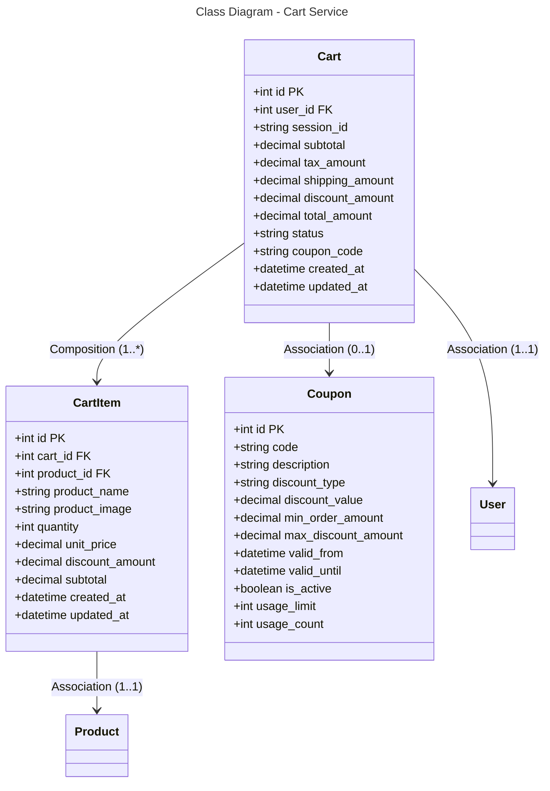

```mermaid
---
title: Database Schema - Cart Service (PostgreSQL)
---
erDiagram
    CART {
        int id PK
        int user_id FK
        string session_id
        decimal subtotal
        decimal tax_amount
        decimal shipping_amount
        decimal discount_amount
        decimal total_amount
        string status
        string coupon_code
        datetime created_at
        datetime updated_at
    }
    
    CART_ITEM {
        int id PK
        int cart_id FK
        int product_id FK
        string product_name
        string product_image
        int quantity
        decimal unit_price
        decimal discount_amount
        decimal subtotal
        datetime created_at
        datetime updated_at
    }
    
    COUPON {
        int id PK
        string code
        string description
        string discount_type
        decimal discount_value
        decimal min_order_amount
        decimal max_discount_amount
        datetime valid_from
        datetime valid_until
        boolean is_active
        int usage_limit
        int usage_count
    }
    
    CART ||--o{ CART_ITEM : "1:*"
    CART }o--|| USER : "*:1"
    CART_ITEM }o--|| PRODUCT : "*:1"
    CART }o--|| COUPON : "0:1"