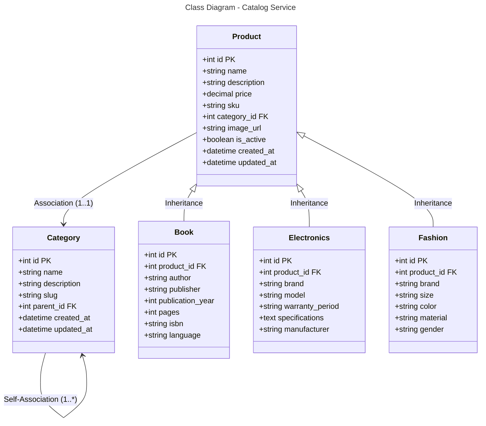

```mermaid
---
title: Database Schema - Catalog Service (MySQL)
---
erDiagram
    CATEGORY {
        int id PK
        string name
        string description
        string slug
        int parent_id FK
        datetime created_at
        datetime updated_at
    }
    
    PRODUCT {
        int id PK
        string name
        string description
        decimal price
        string sku
        int category_id FK
        string image_url
        boolean is_active
        datetime created_at
        datetime updated_at
    }
    
    BOOK {
        int id PK
        int product_id FK
        string author
        string publisher
        int publication_year
        int pages
        string isbn
        string language
    }
    
    ELECTRONICS {
        int id PK
        int product_id FK
        string brand
        string model
        string warranty_period
        text specifications
        string manufacturer
    }
    
    FASHION {
        int id PK
        int product_id FK
        string brand
        string size
        string color
        string material
        string gender
    }
    
    PRODUCT ||--o{ BOOK : "1:1"
    PRODUCT ||--o{ ELECTRONICS : "1:1"
    PRODUCT ||--o{ FASHION : "1:1"
    PRODUCT }o--|| CATEGORY : "*:1"
    CATEGORY }o--|| CATEGORY : "*:1"