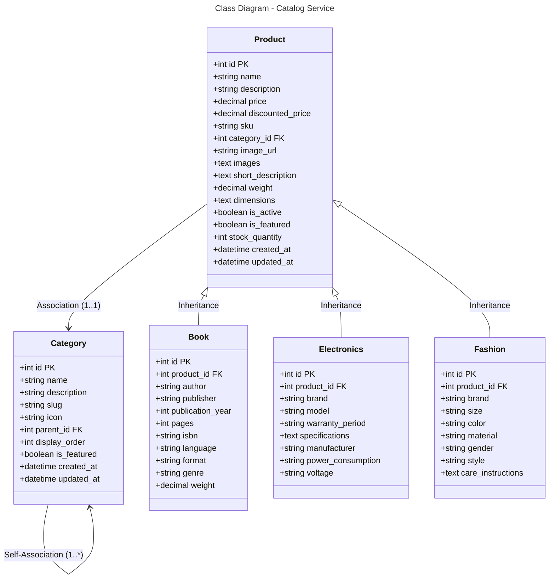

```mermaid
---
title: Database Schema - Catalog Service (MySQL)
---
erDiagram
    CATEGORY {
        int id PK
        string name
        string description
        string slug
        string icon
        int parent_id FK
        int display_order
        boolean is_featured
        datetime created_at
        datetime updated_at
    }
    
    PRODUCT {
        int id PK
        string name
        string description
        decimal price
        decimal discounted_price
        string sku
        int category_id FK
        string image_url
        text images
        text short_description
        decimal weight
        text dimensions
        boolean is_active
        boolean is_featured
        int stock_quantity
        datetime created_at
        datetime updated_at
    }
    
    BOOK {
        int id PK
        int product_id FK
        string author
        string publisher
        int publication_year
        int pages
        string isbn
        string language
        string format
        string genre
        decimal weight
    }
    
    ELECTRONICS {
        int id PK
        int product_id FK
        string brand
        string model
        string warranty_period
        text specifications
        string manufacturer
        string power_consumption
        string voltage
    }
    
    FASHION {
        int id PK
        int product_id FK
        string brand
        string size
        string color
        string material
        string gender
        string style
        text care_instructions
    }
    
    PRODUCT ||--o{ BOOK : "1:1"
    PRODUCT ||--o{ ELECTRONICS : "1:1"
    PRODUCT ||--o{ FASHION : "1:1"
    PRODUCT }o--|| CATEGORY : "*:1"
    CATEGORY }o--|| CATEGORY : "*:1"