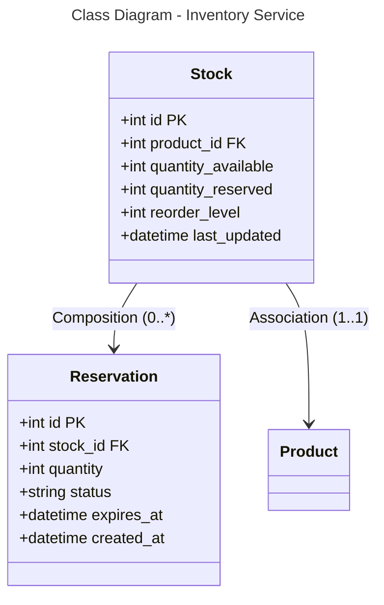

```mermaid
---
title: Database Schema - Inventory Service (PostgreSQL)
---
erDiagram
    STOCK {
        int id PK
        int product_id FK
        int quantity_available
        int quantity_reserved
        int reorder_level
        datetime last_updated
    }
    
    RESERVATION {
        int id PK
        int stock_id FK
        int quantity
        string status
        datetime expires_at
        datetime created_at
    }
    
    STOCK ||--o{ RESERVATION : "0:*"
    STOCK }o--|| PRODUCT : "*:1"