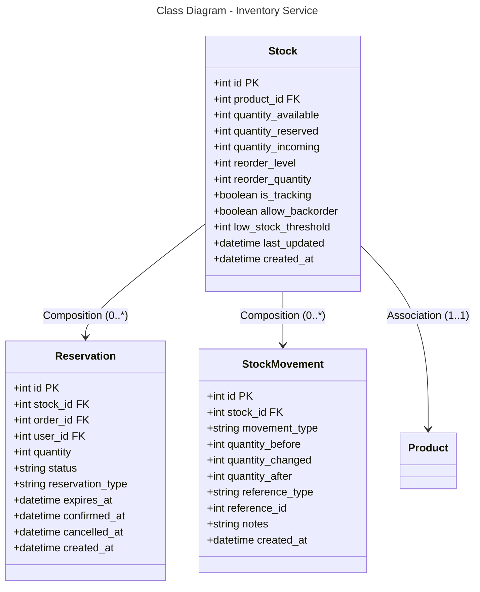

```mermaid
---
title: Database Schema - Inventory Service (PostgreSQL)
---
erDiagram
    STOCK {
        int id PK
        int product_id FK
        int quantity_available
        int quantity_reserved
        int quantity_incoming
        int reorder_level
        int reorder_quantity
        boolean is_tracking
        boolean allow_backorder
        int low_stock_threshold
        datetime last_updated
        datetime created_at
    }
    
    RESERVATION {
        int id PK
        int stock_id FK
        int order_id FK
        int user_id FK
        int quantity
        string status
        string reservation_type
        datetime expires_at
        datetime confirmed_at
        datetime cancelled_at
        datetime created_at
    }
    
    STOCK_MOVEMENT {
        int id PK
        int stock_id FK
        string movement_type
        int quantity_before
        int quantity_changed
        int quantity_after
        string reference_type
        int reference_id
        string notes
        datetime created_at
    }
    
    STOCK ||--o{ RESERVATION : "0:*"
    STOCK ||--o{ STOCK_MOVEMENT : "0:*"
    STOCK }o--|| PRODUCT : "*:1"