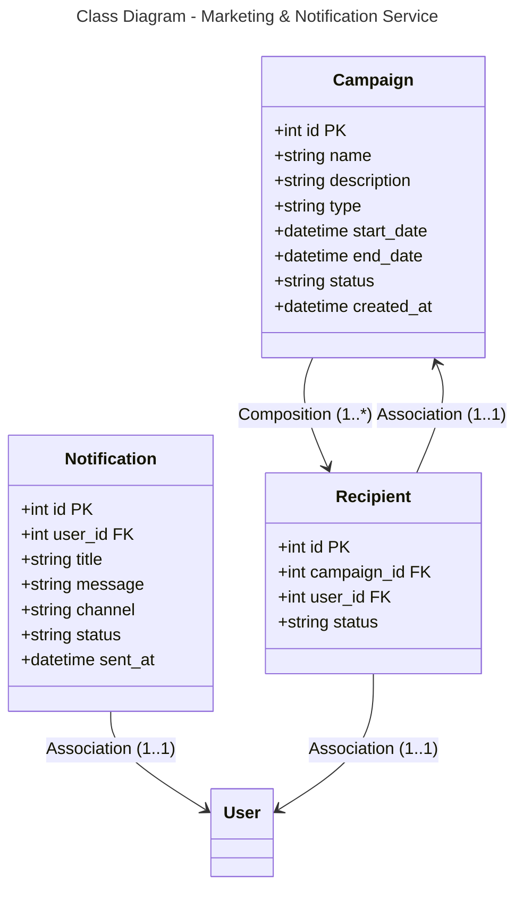

```mermaid
---
title: Database Schema - Marketing & Notification Service (PostgreSQL)
---
erDiagram
    CAMPAIGN {
        int id PK
        string name
        string description
        string type
        datetime start_date
        datetime end_date
        string status
        datetime created_at
    }
    
    NOTIFICATION {
        int id PK
        int user_id FK
        string title
        string message
        string channel
        string status
        datetime sent_at
    }
    
    RECIPIENT {
        int id PK
        int campaign_id FK
        int user_id FK
        string status
    }
    
    CAMPAIGN ||--o{ RECIPIENT : "1:*"
    NOTIFICATION }o--|| USER : "*:1"
    RECIPIENT }o--|| USER : "*:1"
    RECIPIENT }o--|| CAMPAIGN : "*:1"