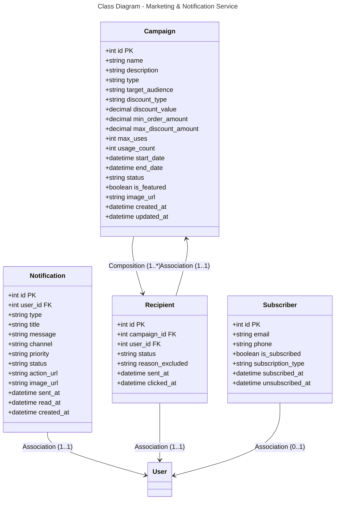

```mermaid
---
title: Database Schema - Marketing & Notification Service (PostgreSQL)
---
erDiagram
    CAMPAIGN {
        int id PK
        string name
        string description
        string type
        string target_audience
        string discount_type
        decimal discount_value
        decimal min_order_amount
        decimal max_discount_amount
        int max_uses
        int usage_count
        datetime start_date
        datetime end_date
        string status
        boolean is_featured
        string image_url
        datetime created_at
        datetime updated_at
    }
    
    NOTIFICATION {
        int id PK
        int user_id FK
        string type
        string title
        string message
        string channel
        string priority
        string status
        string action_url
        string image_url
        datetime sent_at
        datetime read_at
        datetime created_at
    }
    
    RECIPIENT {
        int id PK
        int campaign_id FK
        int user_id FK
        string status
        string reason_excluded
        datetime sent_at
        datetime clicked_at
    }
    
    SUBSCRIBER {
        int id PK
        string email
        string phone
        boolean is_subscribed
        string subscription_type
        datetime subscribed_at
        datetime unsubscribed_at
    }
    
    CAMPAIGN ||--o{ RECIPIENT : "1:*"
    NOTIFICATION }o--|| USER : "*:1"
    RECIPIENT }o--|| USER : "*:1"
    RECIPIENT }o--|| CAMPAIGN : "*:1"