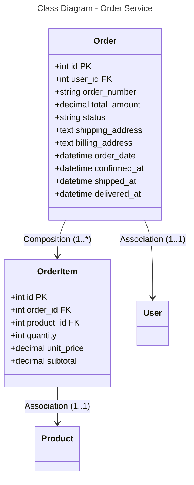

```mermaid
---
title: Database Schema - Order Service (PostgreSQL)
---
erDiagram
    ORDER {
        int id PK
        int user_id FK
        string order_number
        decimal total_amount
        string status
        text shipping_address
        text billing_address
        datetime order_date
        datetime confirmed_at
        datetime shipped_at
        datetime delivered_at
    }
    
    ORDER_ITEM {
        int id PK
        int order_id FK
        int product_id FK
        int quantity
        decimal unit_price
        decimal subtotal
    }
    
    ORDER ||--o{ ORDER_ITEM : "1:*"
    ORDER }o--|| USER : "*:1"
    ORDER_ITEM }o--|| PRODUCT : "*:1"