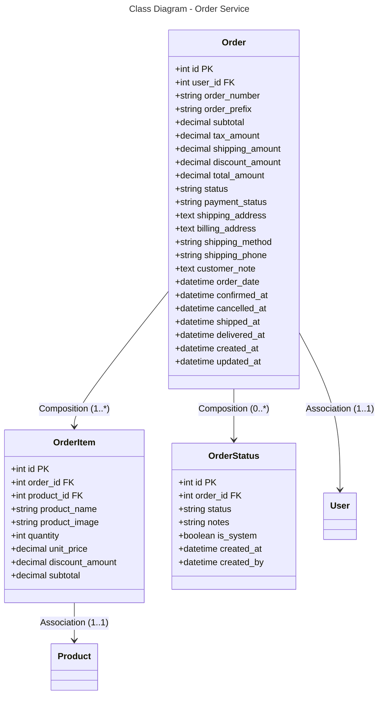

```mermaid
---
title: Database Schema - Order Service (PostgreSQL)
---
erDiagram
    ORDER {
        int id PK
        int user_id FK
        string order_number
        string order_prefix
        decimal subtotal
        decimal tax_amount
        decimal shipping_amount
        decimal discount_amount
        decimal total_amount
        string status
        string payment_status
        text shipping_address
        text billing_address
        string shipping_method
        string shipping_phone
        text customer_note
        datetime order_date
        datetime confirmed_at
        datetime cancelled_at
        datetime shipped_at
        datetime delivered_at
        datetime created_at
        datetime updated_at
    }
    
    ORDER_ITEM {
        int id PK
        int order_id FK
        int product_id FK
        string product_name
        string product_image
        int quantity
        decimal unit_price
        decimal discount_amount
        decimal subtotal
    }
    
    ORDER_STATUS {
        int id PK
        int order_id FK
        string status
        string notes
        boolean is_system
        datetime created_at
        datetime created_by
    }
    
    ORDER ||--o{ ORDER_ITEM : "1:*"
    ORDER ||--o{ ORDER_STATUS : "0:*"
    ORDER }o--|| USER : "*:1"
    ORDER_ITEM }o--|| PRODUCT : "*:1"