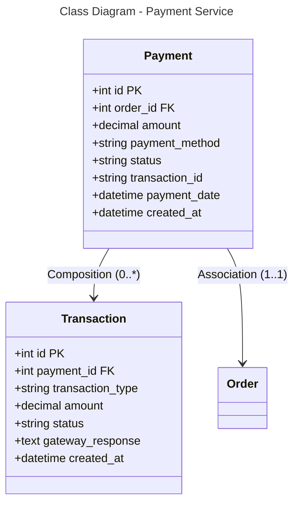

```mermaid
---
title: Database Schema - Payment Service (PostgreSQL)
---
erDiagram
    PAYMENT {
        int id PK
        int order_id FK
        decimal amount
        string payment_method
        string status
        string transaction_id
        datetime payment_date
        datetime created_at
    }
    
    TRANSACTION {
        int id PK
        int payment_id FK
        string transaction_type
        decimal amount
        string status
        text gateway_response
        datetime created_at
    }
    
    PAYMENT ||--o{ TRANSACTION : "0:*"
    PAYMENT }o--|| ORDER : "*:1"