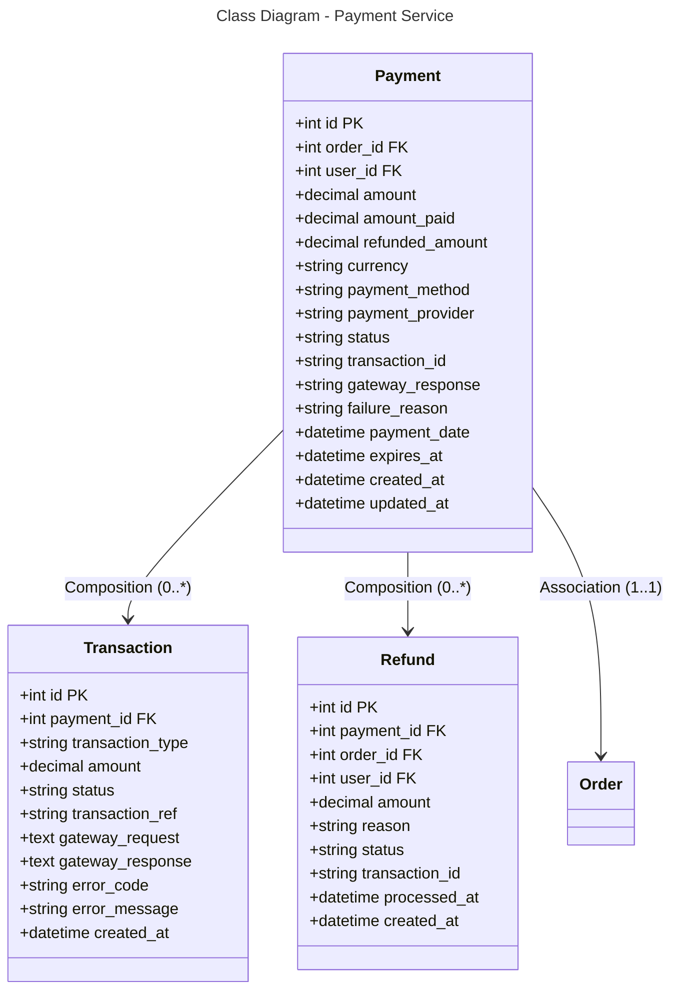

```mermaid
---
title: Database Schema - Payment Service (PostgreSQL)
---
erDiagram
    PAYMENT {
        int id PK
        int order_id FK
        int user_id FK
        decimal amount
        decimal amount_paid
        decimal refunded_amount
        string currency
        string payment_method
        string payment_provider
        string status
        string transaction_id
        string gateway_response
        string failure_reason
        datetime payment_date
        datetime expires_at
        datetime created_at
        datetime updated_at
    }
    
    TRANSACTION {
        int id PK
        int payment_id FK
        string transaction_type
        decimal amount
        string status
        string transaction_ref
        text gateway_request
        text gateway_response
        string error_code
        string error_message
        datetime created_at
    }
    
    REFUND {
        int id PK
        int payment_id FK
        int order_id FK
        int user_id FK
        decimal amount
        string reason
        string status
        string transaction_id
        datetime processed_at
        datetime created_at
    }
    
    PAYMENT ||--o{ TRANSACTION : "0:*"
    PAYMENT ||--o{ REFUND : "0:*"
    PAYMENT }o--|| ORDER : "*:1"