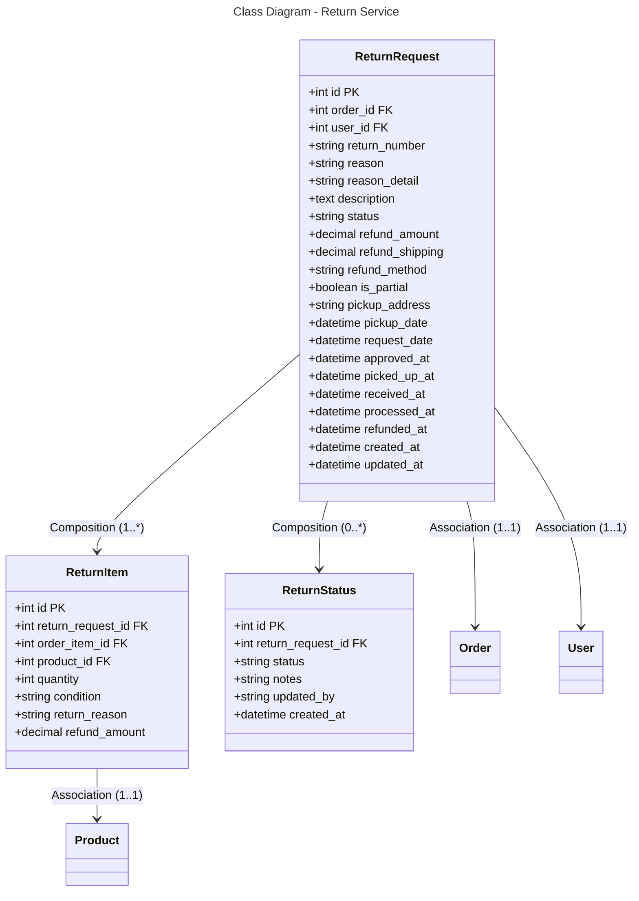

```mermaid
---
title: Database Schema - Return Service (PostgreSQL)
---
erDiagram
    RETURN_REQUEST {
        int id PK
        int order_id FK
        int user_id FK
        string return_number
        string reason
        string reason_detail
        text description
        string status
        decimal refund_amount
        decimal refund_shipping
        string refund_method
        boolean is_partial
        string pickup_address
        datetime pickup_date
        datetime request_date
        datetime approved_at
        datetime picked_up_at
        datetime received_at
        datetime processed_at
        datetime refunded_at
        datetime created_at
        datetime updated_at
    }
    
    RETURN_ITEM {
        int id PK
        int return_request_id FK
        int order_item_id FK
        int product_id FK
        int quantity
        string condition
        string return_reason
        decimal refund_amount
    }
    
    RETURN_STATUS {
        int id PK
        int return_request_id FK
        string status
        string notes
        string updated_by
        datetime created_at
    }
    
    RETURN_REQUEST ||--o{ RETURN_ITEM : "1:*"
    RETURN_REQUEST ||--o{ RETURN_STATUS : "0:*"
    RETURN_REQUEST }o--|| ORDER : "*:1"
    RETURN_REQUEST }o--|| USER : "*:1"
    RETURN_ITEM }o--|| PRODUCT : "*:1"