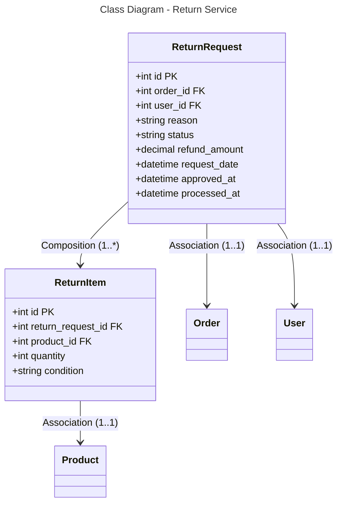

```mermaid
---
title: Database Schema - Return Service (PostgreSQL)
---
erDiagram
    RETURN_REQUEST {
        int id PK
        int order_id FK
        int user_id FK
        string reason
        string status
        decimal refund_amount
        datetime request_date
        datetime approved_at
        datetime processed_at
    }
    
    RETURN_ITEM {
        int id PK
        int return_request_id FK
        int product_id FK
        int quantity
        string condition
    }
    
    RETURN_REQUEST ||--o{ RETURN_ITEM : "1:*"
    RETURN_REQUEST }o--|| ORDER : "*:1"
    RETURN_REQUEST }o--|| USER : "*:1"
    RETURN_ITEM }o--|| PRODUCT : "*:1"