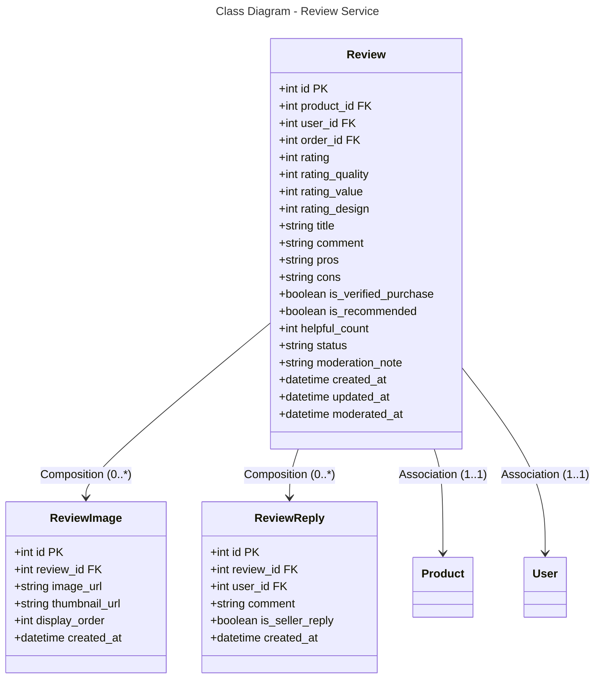

```mermaid
---
title: Database Schema - Review Service (PostgreSQL)
---
erDiagram
    REVIEW {
        int id PK
        int product_id FK
        int user_id FK
        int order_id FK
        int rating
        int rating_quality
        int rating_value
        int rating_design
        string title
        string comment
        string pros
        string cons
        boolean is_verified_purchase
        boolean is_recommended
        int helpful_count
        string status
        string moderation_note
        datetime created_at
        datetime updated_at
        datetime moderated_at
    }
    
    REVIEW_IMAGE {
        int id PK
        int review_id FK
        string image_url
        string thumbnail_url
        int display_order
        datetime created_at
    }
    
    REVIEW_REPLY {
        int id PK
        int review_id FK
        int user_id FK
        string comment
        boolean is_seller_reply
        datetime created_at
    }
    
    REVIEW ||--o{ REVIEW_IMAGE : "0:*"
    REVIEW ||--o{ REVIEW_REPLY : "0:*"
    REVIEW }o--|| PRODUCT : "*:1"
    REVIEW }o--|| USER : "*:1"