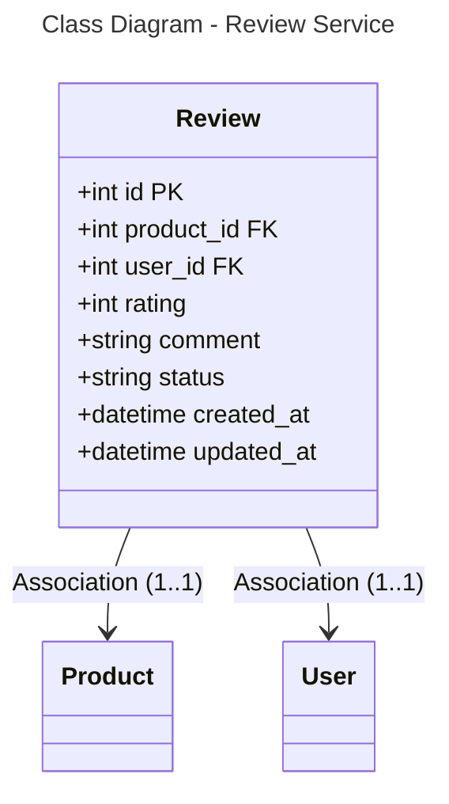

```mermaid
---
title: Database Schema - Review Service (PostgreSQL)
---
erDiagram
    REVIEW {
        int id PK
        int product_id FK
        int user_id FK
        int rating
        string comment
        string status
        datetime created_at
        datetime updated_at
    }
    
    REVIEW }o--|| PRODUCT : "*:1"
    REVIEW }o--|| USER : "*:1"