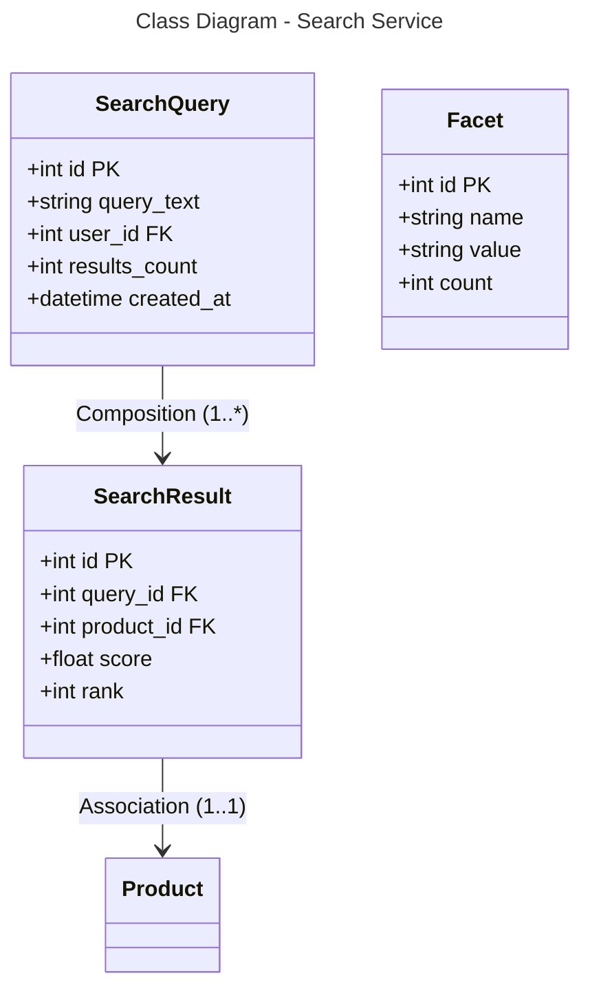

```mermaid
---
title: Database Schema - Search Service (PostgreSQL + Elasticsearch)
---
erDiagram
    SEARCH_QUERY {
        int id PK
        string query_text
        int user_id FK
        int results_count
        datetime created_at
    }
    
    SEARCH_RESULT {
        int id PK
        int query_id FK
        int product_id FK
        float score
        int rank
    }
    
    FACET {
        int id PK
        string name
        string value
        int count
    }
    
    SEARCH_QUERY ||--o{ SEARCH_RESULT : "1:*"
    SEARCH_RESULT }o--|| PRODUCT : "*:1"