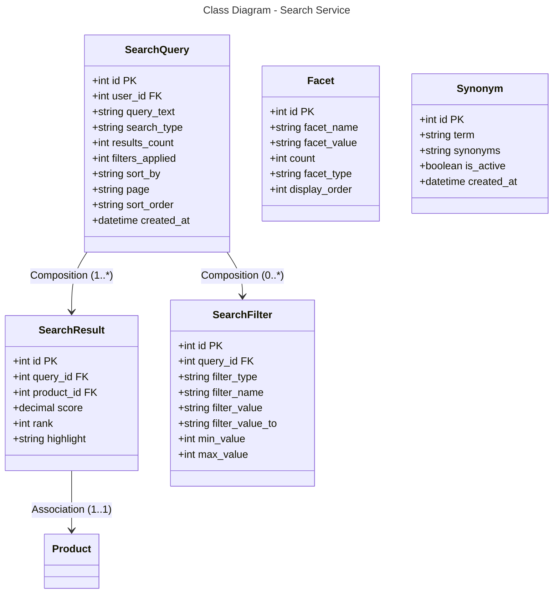

```mermaid
---
title: Database Schema - Search Service (PostgreSQL + Elasticsearch)
---
erDiagram
    SEARCH_QUERY {
        int id PK
        int user_id FK
        string query_text
        string search_type
        int results_count
        int filters_applied
        string sort_by
        string page
        string sort_order
        datetime created_at
    }
    
    SEARCH_RESULT {
        int id PK
        int query_id FK
        int product_id FK
        decimal score
        int rank
        string highlight
    }
    
    SEARCH_FILTER {
        int id PK
        int query_id FK
        string filter_type
        string filter_name
        string filter_value
        string filter_value_to
        int min_value
        int max_value
    }
    
    FACET {
        int id PK
        string facet_name
        string facet_value
        int count
        string facet_type
        int display_order
    }
    
    SYNONYM {
        int id PK
        string term
        string synonyms
        boolean is_active
        datetime created_at
    }
    
    SEARCH_QUERY ||--o{ SEARCH_RESULT : "1:*"
    SEARCH_QUERY ||--o{ SEARCH_FILTER : "0:*"
    SEARCH_RESULT }o--|| PRODUCT : "*:1"