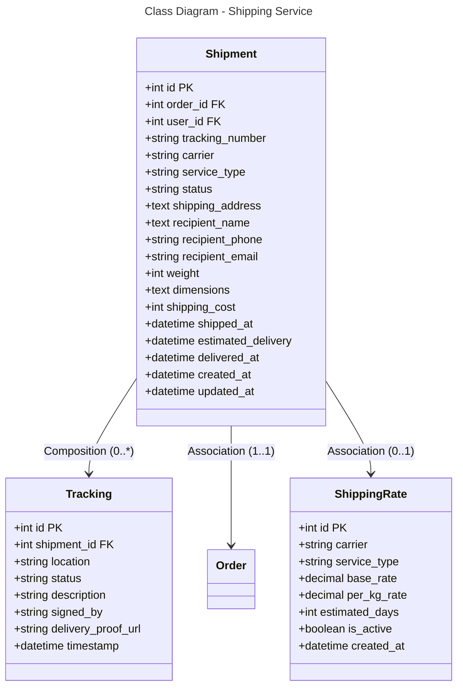

```mermaid
---
title: Database Schema - Shipping Service (PostgreSQL)
---
erDiagram
    SHIPMENT {
        int id PK
        int order_id FK
        int user_id FK
        string tracking_number
        string carrier
        string service_type
        string status
        text shipping_address
        text recipient_name
        string recipient_phone
        string recipient_email
        int weight
        text dimensions
        int shipping_cost
        datetime shipped_at
        datetime estimated_delivery
        datetime delivered_at
        datetime created_at
        datetime updated_at
    }
    
    TRACKING {
        int id PK
        int shipment_id FK
        string location
        string status
        string description
        string signed_by
        string delivery_proof_url
        datetime timestamp
    }
    
    SHIPPING_RATE {
        int id PK
        string carrier
        string service_type
        decimal base_rate
        decimal per_kg_rate
        int estimated_days
        boolean is_active
        datetime created_at
    }
    
    SHIPMENT ||--o{ TRACKING : "0:*"
    SHIPMENT }o--|| ORDER : "*:1"
    SHIPMENT }o--|| SHIPPING_RATE : "0:1"