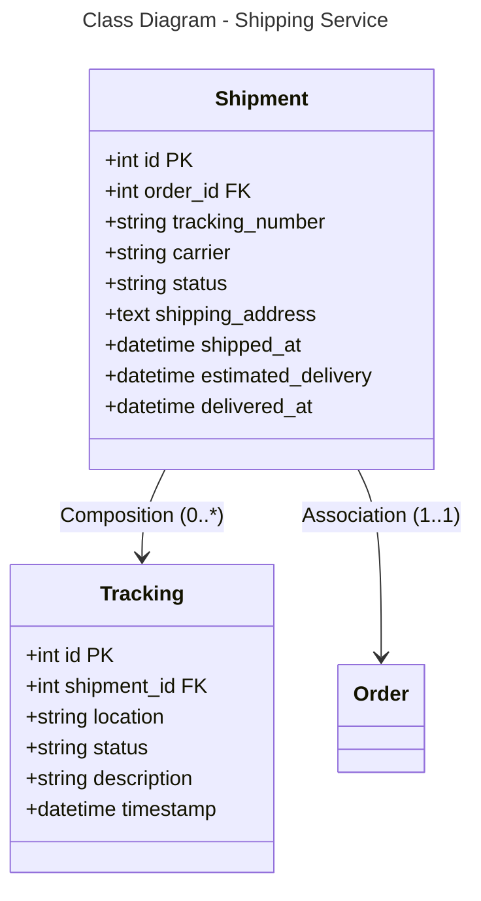

```mermaid
---
title: Database Schema - Shipping Service (PostgreSQL)
---
erDiagram
    SHIPMENT {
        int id PK
        int order_id FK
        string tracking_number
        string carrier
        string status
        text shipping_address
        datetime shipped_at
        datetime estimated_delivery
        datetime delivered_at
    }
    
    TRACKING {
        int id PK
        int shipment_id FK
        string location
        string status
        string description
        datetime timestamp
    }
    
    SHIPMENT ||--o{ TRACKING : "0:*"
    SHIPMENT }o--|| ORDER : "*:1"