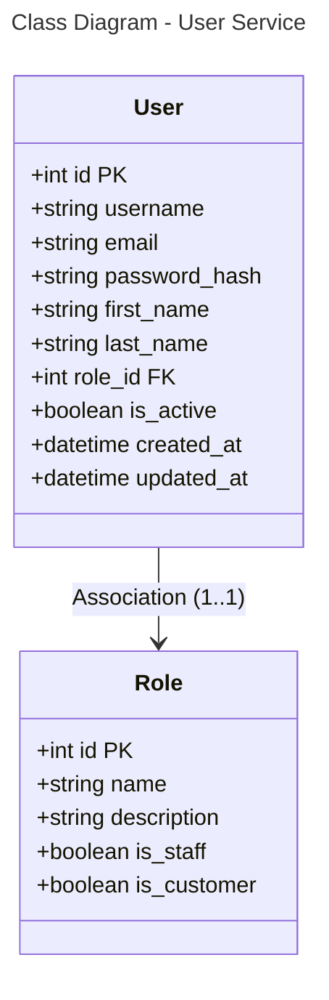

```mermaid
---
title: Database Schema - User Service (PostgreSQL)
---
erDiagram
    USER {
        int id PK
        string username
        string email
        string password_hash
        string first_name
        string last_name
        int role_id FK
        boolean is_active
        datetime created_at
        datetime updated_at
    }
    
    ROLE {
        int id PK
        string name
        string description
        boolean is_staff
        boolean is_customer
    }
    
    USER }o--|| ROLE : "*:1"