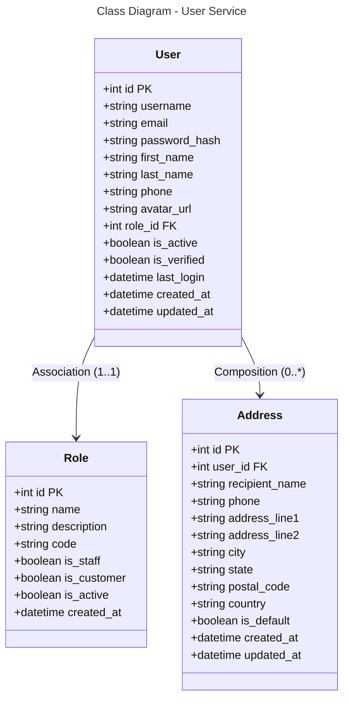

```mermaid
---
title: Database Schema - User Service (PostgreSQL)
---
erDiagram
    USER {
        int id PK
        string username
        string email
        string password_hash
        string first_name
        string last_name
        string phone
        string avatar_url
        int role_id FK
        boolean is_active
        boolean is_verified
        datetime last_login
        datetime created_at
        datetime updated_at
    }
    
    ROLE {
        int id PK
        string name
        string description
        string code
        boolean is_staff
        boolean is_customer
        boolean is_active
        datetime created_at
    }
    
    ADDRESS {
        int id PK
        int user_id FK
        string recipient_name
        string phone
        string address_line1
        string address_line2
        string city
        string state
        string postal_code
        string country
        boolean is_default
        datetime created_at
        datetime updated_at
    }
    
    USER }o--|| ROLE : "*:1"
    USER ||--o{ ADDRESS : "0:*"